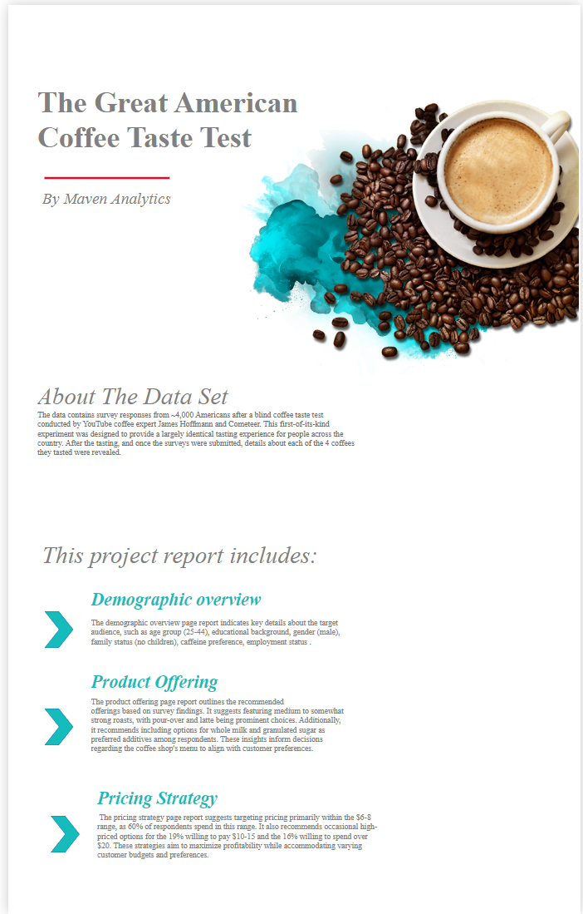

# Maven-Analytics-coffee-challenge
Power BI The Great  American coffee Taste test challenge

About The Data Set
The data contains survey responses from ~4,000 Americans after a blind coffee taste test conducted by YouTube coffee expert James Hoffmann and Cometeer. This first-of-its-kind experiment was designed to provide a largely identical tasting experience for people across the country. After the tasting, and once the surveys were submitted, details about each of the 4 coffees they tasted were revealed.

